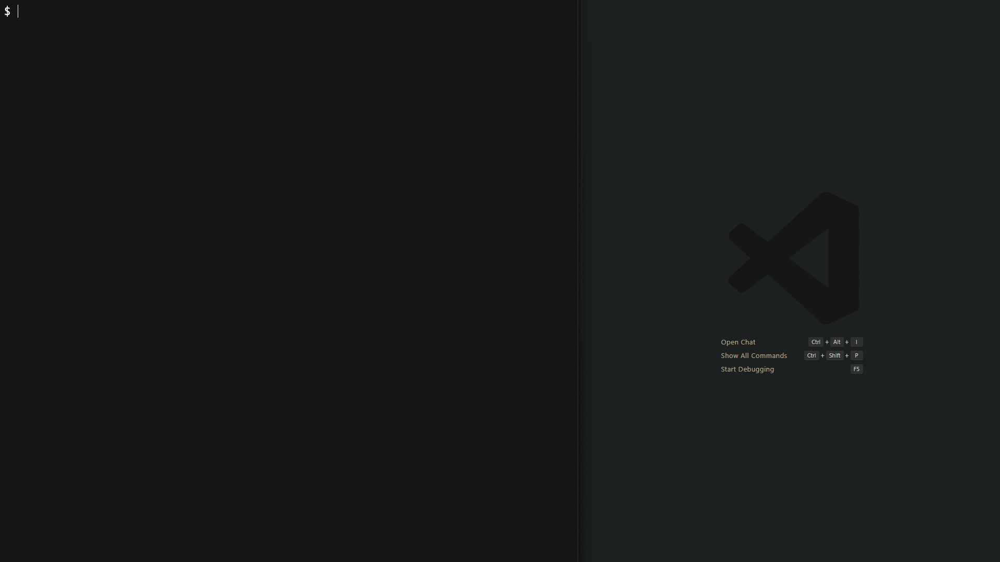

# merlin-commit

  <p align="center">
    
  </p>

> Interactive CLI for creating [Conventional Commits](https://www.conventionalcommits.org/) with a wizard-themed interface

  <p align="center">
    <a href="https://www.npmjs.com/package/merlin-commit"></a>
    
    
  </p>

Merlin guides you through each part of a commit message - type, scope, subject, body, breaking changes, and issue references - validating your input in real time and producing consistently formatted messages your whole team can rely on.

---

## Preview

  <p align="center">
    
  </p>

---

## Features

- **Wizard UI** - step-by-step prompts with real-time character counters and validation
- **Conventional Commits** - enforces the spec automatically; 11 built-in types with emoji
- **Two themes** - wizard (default) and standard for teams that prefer plain output
- **Auto-add** - interactive file picker to stage changes before the commit prompt
- **Editor integration** - opens your preferred editor for long-form body, breaking changes, and issue references
- **Team config** - project-level `.merlinrc.json` checked into version control keeps standards consistent
- **Commitlint sync** - writes matching rules to `commitlint.config.js` with a single command
- **Offline-first** - no network calls, no telemetry, no data collection

---

## Installation

**Global (recommended for individuals):**

```bash
npm install -g merlin-commit
```

**Project dev dependency (recommended for teams):**

```bash
npm install -D merlin-commit
```

**One-shot with npx:**

```bash
npx merlin-commit
```

---

## Quick Start

1. Stage your changes:

    ```bash
    git add .
    ```

2. Run the wizard:

    ```bash
    merlin
    ```

3. Follow the prompts - select a type, enter a scope and subject, and confirm. Merlin creates the commit.

---

## Commands

| Command                                 | Description                                                        |
| --------------------------------------- | ------------------------------------------------------------------ |
| `merlin` / `merlin commit` / `merlin c` | Run the interactive commit wizard                                  |
| `merlin config`                         | Open the configuration menu                                        |
| `merlin init`                           | Set up husky, commitlint, and a project config for your repository |

**Commit flags:**

| Flag          | Description                                            |
| ------------- | ------------------------------------------------------ |
| `--dry-run`   | Preview the commit message without creating the commit |
| `--no-verify` | Skip git hooks (commitlint, husky)                     |
| `--amend`     | Amend the previous commit                              |

---

## Configuration

Merlin reads from `~/.merlinrc.json` (user) and `.merlinrc.json` at the repository root (project). Project values take precedence over user values, and both layers override the defaults.

See [docs/reference/config-schema.md](docs/reference/config-schema.md) for every field, its type, valid range, and default value.

---

## Documentation

| Document                                                        | Description                                    |
| --------------------------------------------------------------- | ---------------------------------------------- |
| [Installation](docs/getting-started/installation.md)            | Requirements, install methods, troubleshooting |
| [Quick Start](docs/getting-started/quickstart.md)               | First commit, step by step                     |
| [Commit Types](docs/usage/commit-types.md)                      | All 11 built-in types with usage guidance      |
| [Themes](docs/usage/themes.md)                                  | Wizard and standard UI themes                  |
| [Editor Integration](docs/usage/editor-integration.md)          | VS Code, Neovim, Emacs, Nano setup             |
| [Auto-Add](docs/usage/auto-add.md)                              | Interactive file staging before committing     |
| [CLI Reference](docs/reference/cli-reference.md)                | Every command, flag, and option                |
| [Configuration](docs/reference/configuration.md)                | Config files, merge strategy, common tasks     |
| [Config Schema](docs/reference/config-schema.md)                | Complete `.merlinrc.json` field reference      |
| [Team Setup](docs/guides/team-setup.md)                         | Step-by-step team rollout guide                |
| [Commitlint Integration](docs/guides/commitlint-integration.md) | Syncing merlin rules to commitlint             |
| [Contributing](docs/development/contributing.md)                | Development setup and PR process               |
| [Architecture](docs/development/architecture.md)                | Code layers, data flow, design decisions       |
| [Testing](docs/development/testing.md)                          | Test patterns, running tests, coverage         |
| [Releases](docs/development/releases.md)                        | Release process for maintainers                |

---

## Contributing

See [docs/development/contributing.md](docs/development/contributing.md) for development setup, coding standards, and the pull request process.

---

## License

MIT © mBukator
