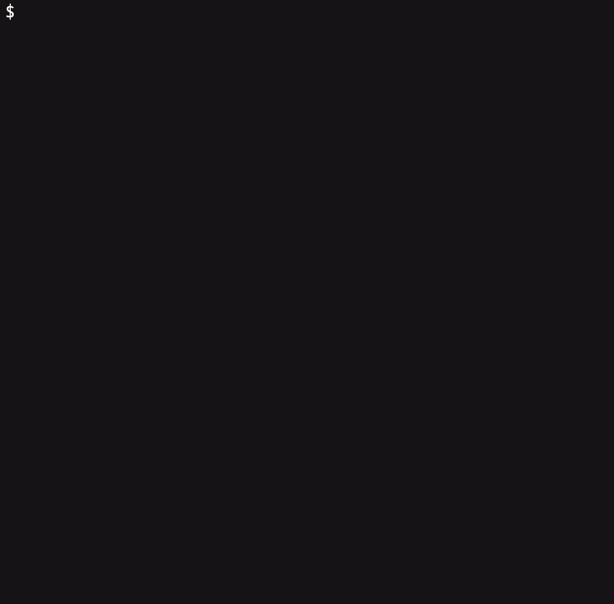

# Installation

---

## Requirements

| Requirement | Version                          |
| ----------- | -------------------------------- |
| Node.js     | >= 22.0.0                        |
| npm         | >= 9.0.0 (bundled with Node 18+) |
| Git         | Any recent version               |

Verify your Node.js version:

```bash
node --version
# v20.0.0 or higher is recommended
```

---

## Global Installation

Global installation makes `merlin` available in every repository on your machine. This is the recommended approach for individual developers.

**npm:**

```bash
npm install -g merlin-commit
```

**yarn:**

```bash
yarn global add merlin-commit
```

**pnpm:**

```bash
pnpm add -g merlin-commit
```

---

## Project-Local Installation

Installing as a dev dependency pins the version for your team and makes it available via `npx merlin` or through package scripts. This approach ensures everyone uses the same version.

```bash
npm install -D merlin-commit
```

Then add a script to `package.json`:

```json
{
    "scripts": {
        "commit": "merlin"
    }
}
```

Use via:

```bash
npm run commit
```

---

## One-Shot with npx

Run merlin without installing it permanently:

```bash
npx merlin-commit
```

This downloads and runs the latest version. Useful for trying it out before committing to an install.

---

## Verifying the Installation

After installing, confirm the binary is accessible:

```bash
merlin --version
```

This should print the installed version number.

To set up husky, commitlint, and a project config in one step, run:

```bash
merlin init
```

<p align="center">
  
</p>

---

## Uninstalling

**If installed globally:**

```bash
npm uninstall -g merlin-commit
```

**If installed as a project dependency:**

```bash
npm uninstall --save-dev merlin-commit
```

---

## Troubleshooting

### `merlin: command not found`

The global npm bin directory is not on your `PATH`.

Find the directory:

```bash
npm bin -g
```

Add it to your shell profile (`~/.bashrc`, `~/.zshrc`, or equivalent):

```bash
export PATH="$(npm bin -g):$PATH"
```

Reload your shell:

```bash
source ~/.zshrc  # or ~/.bashrc
```

### Permission errors on global install

On macOS/Linux, if you see `EACCES` errors:

**Option 1 - Use a Node version manager (recommended):**
Tools like [nvm](https://github.com/nvm-sh/nvm) or [fnm](https://github.com/Schniz/fnm) install Node in your home directory, so global npm installs do not require elevated permissions.

**Option 2 - Fix npm directory permissions:**

```bash
mkdir ~/.npm-global
npm config set prefix '~/.npm-global'
export PATH=~/.npm-global/bin:$PATH
```

### Using in CI environments

merlin-commit is an interactive tool that requires a TTY. It is not designed for use in non-interactive CI pipelines. If you use merlin in your workflow, developers run it locally before pushing - the commit is then validated in CI by the `commitlint` hook rather than by merlin itself.

For CI commit validation, set up the `commit-msg` git hook via `merlin init`. See [Team Setup](../guides/team-setup.md).

---

## What's Next

- [Quick Start](quickstart.md) - Create your first commit
- [CLI Reference](../reference/cli-reference.md) - All commands and flags
