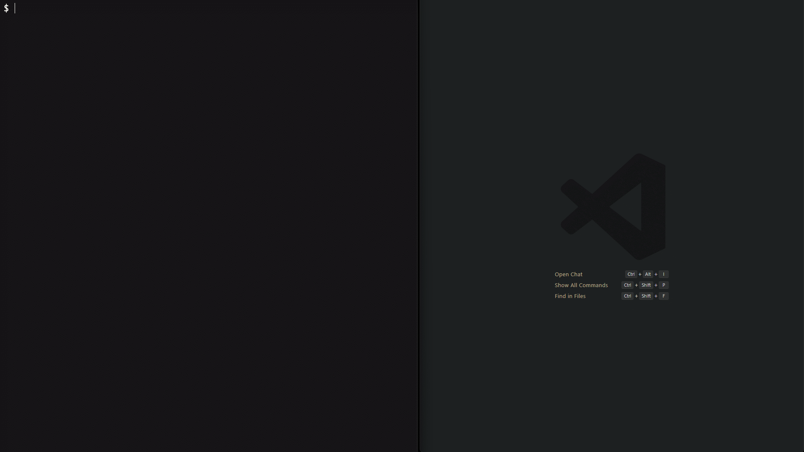

# Editor Integration

Merlin Commit uses an external editor for three optional fields: **body**, **breaking changes**, and **issue references**. Any editor that can open and block the terminal until the file is saved works.

---

## How It Works

When you answer Yes to a multi-line field prompt, merlin:

1. Writes a template to `.git/COMMIT_EDITMSG` (the same file git uses for commit message editing, so editors with git syntax highlighting work automatically)
2. Launches your configured editor with that file
3. Waits for the editor to close
4. Reads the file back, stripping any lines that start with `#`
5. Uses the remaining text as the field content

Comment lines (lines beginning with `#`) are stripped on read-back, just as git itself does. This means you can add `#` instructions to templates freely.

<p align="center">
  
</p>

---

## Which Fields Use the Editor

| Field            | Prompt                                                                                               |
| ---------------- | ---------------------------------------------------------------------------------------------------- |
| Body             | "Would you like to weave a detailed tale?" (wizard) / "Add a detailed description?" (standard)       |
| Breaking changes | "Does this spell shatter ancient contracts?" (wizard) / "Are there any breaking changes?" (standard) |
| Issue references | "Does this resolve any quests?" (wizard) / "Reference any issues?" (standard)                        |

Answer Yes (type `y` and press Enter) to open the editor for that field. Answer No or press Enter (the default for all three is No) to skip it.

---

## Editor Detection Order

Merlin resolves the editor command using this priority order - the first non-empty value wins:

1. `editor` field in project `.merlinrc.json`
2. `editor` field in user `~/.merlinrc.json`
3. `$EDITOR` environment variable
4. `$VISUAL` environment variable
5. `notepad` on Windows, `vim` on Unix/macOS

---

## Configuring Your Editor

### Via the config menu

```bash
merlin config
# → User config → Default editor
# Enter your editor command, e.g.: code --wait
```

### Via config file

```json
{
    "editor": "code --wait"
}
```

---

## Per-Editor Setup

### VS Code

VS Code requires the `--wait` flag so that merlin pauses until you close the tab.

```json
{
    "editor": "code --wait"
}
```

If `code` is not on your PATH, open VS Code, open the Command Palette (`Ctrl+Shift+P` / `Cmd+Shift+P`), and run **Shell Command: Install 'code' command in PATH**.

**Tip:** VS Code recognizes `.git/COMMIT_EDITMSG` and applies git commit message syntax highlighting automatically.

### Neovim / Vim

Vim is the default on Unix systems and requires no configuration. To set it explicitly:

```json
{
    "editor": "nvim"
}
```

Edit the template, save with `:w`, and quit with `:q`. Both together: `:wq`.

### Emacs

Use `emacsclient` with the `--wait` flag to block until the buffer is closed:

```json
{
    "editor": "emacsclient --wait"
}
```

Start an Emacs server first if it is not already running:

```bash
emacs --daemon
```

Save and close the buffer with `C-x C-s` then `C-x k`.

### Nano

Nano works without any flags:

```json
{
    "editor": "nano"
}
```

Save with `Ctrl+O`, confirm the filename, then exit with `Ctrl+X`.

### Sublime Text

```json
{
    "editor": "subl --wait"
}
```

Requires the `subl` command to be on your PATH. On macOS: `ln -s /Applications/Sublime\ Text.app/Contents/SharedSupport/bin/subl /usr/local/bin/subl`

### JetBrains IDEs (IntelliJ, WebStorm, etc.)

```json
{
    "editor": "idea --wait"
}
```

Use the IDE's **Tools → Create Command-line Launcher** option to install the `idea` (or `webstorm`, `phpstorm`, etc.) binary.

---

## Multi-Word Editor Commands

Editor commands with spaces and flags are supported. The entire string you enter is parsed into a binary and arguments.

Examples of valid editor configurations:

```json
{ "editor": "code --wait" }
{ "editor": "subl -w" }
{ "editor": "emacsclient --wait --no-wait-for-input" }
```

If your editor binary path contains spaces (uncommon), quote it:

```json
{ "editor": "\"/opt/my editor/bin/edit\" --wait" }
```

---

## Template Content

Each field opens the editor with a template pre-filled to guide your input.

### Body template

```
# <type>(<scope>): <subject>
# Staged files:
#   modified: src/auth/login.ts
#   new file: src/auth/oauth.ts
#
# Write a detailed description below.
# Lines starting with '#' are ignored.
```

The comment lines show context from your commit. They are stripped on read-back.

### Breaking changes template

```
# Describe the breaking change below.
# Lines starting with '#' are ignored.
#
# Guidelines:
# - Explain what changed and why
# - Describe what consumers need to update
# - Include migration steps if possible
```

You do not need to write "BREAKING CHANGE:" yourself - merlin adds the prefix automatically.

### Issue references template

```
# Reference issues below, one per line.
# Lines starting with '#' are ignored.
#
# Examples:
#   Closes #123
#   Fixes #456
#   Resolves #789
#   Refs #101
```

---

## Troubleshooting

### The editor does not open

- Verify the editor command is on your PATH: `which vim` / `where code`
- For VS Code, ensure `code` is on PATH (see VS Code section above)
- Check the configured command: `merlin config --show | grep editor`

### Changes are not saved / merlin says the field is empty

- Make sure you save before closing: `:w` in Vim, `Ctrl+O` in Nano, `Ctrl+S` in VS Code
- For VS Code: confirm you are using `code --wait` (not just `code`)
- For Emacs: confirm you closed the buffer, not just saved

### The wrong editor opens

Merlin uses the configured `editor` field first. Check what is configured:

```bash
merlin config --show
```

If `editor` shows a value you did not set, it may be coming from the project config overriding your user config. Check:

```bash
merlin config --show project
```

### `editor exited with error`

The editor exited with a non-zero exit code. This can happen if:

- The editor command is wrong or the binary is not installed
- The editor was force-quit (e.g., `:q!` in Vim without saving discards changes but exits cleanly; closing the terminal mid-edit may exit non-zero)

Merlin logs a warning and continues the commit flow if the editor fails on an optional field - you will not lose your other answers.

---

## Related

- [Configuration](../reference/configuration.md) - Setting the `editor` field
- [CLI Reference](../reference/cli-reference.md) - The `merlin` commit command
